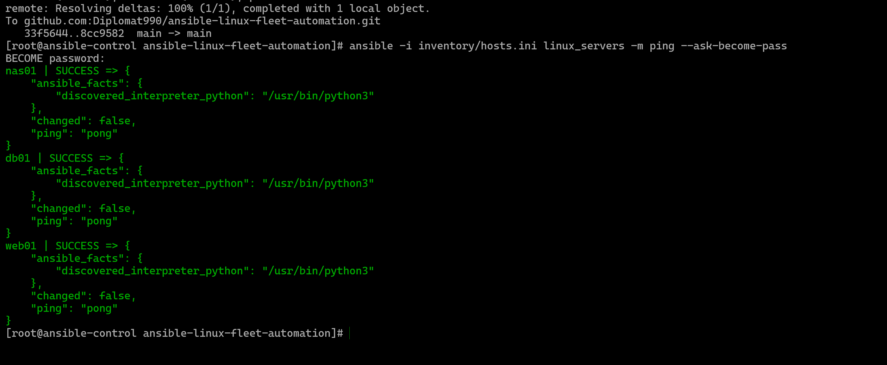

# Ansible Linux Fleet Automation and Patching Lab

## Project Overview

This project simulates a real-world Linux infrastructure support task where a Linux engineer manages multiple RHEL-compatible servers using Ansible.

The lab focuses on automation, user management, SSH access, patching, service validation, hardening, reporting and GitHub-based documentation.

## Scenario

A Linux support engineer is assigned a change ticket to validate connectivity, create a standard admin account, prepare SSH key-based access, patch servers, check critical services, harden SSH, configure firewall rules and collect evidence.

## Lab Environment

| Server          | Role                 | Purpose                         |
| --------------- | -------------------- | ------------------------------- |
| ansible-control | Ansible control node | Runs Ansible playbooks          |
| web01           | Web server           | Simulates Nginx/Apache workload |
| db01            | Database server      | Simulates MariaDB workload      |
| nas01           | NAS/File server      | Simulates Samba/NFS workload    |

## Architecture

```text
Windows Host / VirtualBox
        |
        | SSH
        |
ansible-control
        |
        | Ansible automation
        |
--------------------------------
| web01 | db01 | nas01 |
--------------------------------
```

## Tools Used

* AlmaLinux / RHEL-compatible Linux
* Ansible
* SSH
* Bash
* Git and GitHub
* firewalld
* SELinux
* systemd
* sudo/wheel group
* VirtualBox

## Skills Demonstrated

* Linux server administration
* Ansible inventory management
* Ansible playbook execution
* SSH access management
* SSH key-based authentication
* User and sudo management
* Privilege escalation using sudo/become
* GitHub documentation
* Evidence-based infrastructure work

## Playbooks Created

| Playbook             | Purpose                                                       |
| -------------------- | ------------------------------------------------------------- |
| `01-ping.yml`        | Validates Ansible connectivity to all managed Linux servers   |
| `02-users.yml`       | Creates a standard Linux admin user and configures SSH access |
| `03-patching.yml`    | Planned patching automation                                   |
| `04-services.yml`    | Planned service validation                                    |
| `05-hardening.yml`   | Planned SSH/firewall hardening                                |
| `06-logs-report.yml` | Planned log collection and reporting                          |
| `07-site.yml`        | Planned full automation run                                   |

## 01 - Ansible Connectivity Test

Command used:

```bash
ansible -i inventory/hosts.ini linux_servers -m ping --ask-become-pass
```

Result:

All managed nodes returned `pong`, confirming Ansible connectivity.

### Screenshot Evidence



## 02 - User Management Playbook

Playbook used:

```bash
ansible-playbook -i inventory/hosts.ini playbooks/02-users.yml -u root -k
```

The `02-users.yml` playbook creates a standard Linux admin account called `linuxadmin` across all managed servers.

### What the playbook does

* Creates the `linuxadmin` user
* Sets `/bin/bash` as the default shell
* Adds the user to the `wheel` group for sudo access
* Creates `/home/linuxadmin/.ssh`
* Copies the Ansible control node public SSH key into `authorized_keys`
* Creates a sudoers file for `linuxadmin`

### Why this matters

This simulates a real Linux administration task where a support engineer creates a controlled admin account, configures SSH key-based access and prepares the account for secure remote management.

### Screenshot Evidence


## How to Run

Clone the repository:

```bash
git clone https://github.com/Diplomat990/ansible-linux-fleet-automation.git
cd ansible-linux-fleet-automation
```

Test connectivity:

```bash
ansible -i inventory/hosts.ini linux_servers -m ping
```

Run the connectivity playbook:

```bash
ansible-playbook -i inventory/hosts.ini playbooks/01-ping.yml
```

Run the user management playbook:

```bash
ansible-playbook -i inventory/hosts.ini playbooks/02-users.yml -u root -k
```

## Security Notes

Passwords and private SSH keys are not stored in this repository.

The project is designed to move from temporary root/password access to a more secure model using:

```text
linuxadmin + SSH key authentication + sudo
```

## Ticket Simulation

Ticket ID: `CHG-LNX-001`

Task: Validate Linux server connectivity and create a standard admin account for secure Ansible management.

Acceptance criteria:

* All managed servers are reachable by Ansible
* `linuxadmin` account exists on all servers
* `linuxadmin` has sudo access
* SSH key-based access is configured
* Evidence screenshots are uploaded to GitHub

## Rollback Plan

If the user creation task fails:

1. Login to the affected server as root.
2. Remove the user if required:

```bash
userdel -r linuxadmin
```

3. Remove sudoers file if required:

```bash
rm -f /etc/sudoers.d/linuxadmin
```

4. Re-run the playbook after fixing the issue.

## Lessons Learned

* Ansible requires working SSH access before playbooks can run.
* Ping success confirms network access, but SSH authentication must also be configured correctly.
* Password authentication and SSH key authentication behave differently.
* GitHub documentation should include screenshots, playbooks, commands and evidence.
* Empty folders do not appear in GitHub unless they contain a file such as `.gitkeep`.

## Project Status

| Phase                    | Status      |
| ------------------------ | ----------- |
| GitHub repo created      | Complete    |
| Inventory created        | Complete    |
| Ansible ping tested      | Complete    |
| User management playbook | Complete    |
| Patching playbook        | In progress |
| Services validation      | Planned     |
| Hardening                | Planned     |
| Reporting                | Planned     |


## 04 - Role-Specific Services Playbook

Playbook: `playbooks/04-services.yml`

This playbook installs and enables role-specific services on each managed Linux server.

| Server | Service |
|---|---|
| web01 | Nginx |
| db01 | MariaDB |
| nas01 | Samba / NFS |

### What it does

- Installs Nginx on `web01`
- Installs MariaDB on `db01`
- Installs Samba and NFS tools on `nas01`
- Starts and enables services using `ansible.builtin.systemd_service`
- Confirms service status after installation

### Run command

```bash
ansible-playbook -i inventory/hosts.ini playbooks/04-services.yml -u root -k
```

### Manual validation

```bash
ssh root@192.168.56.21 "systemctl status nginx --no-pager"
ssh root@192.168.56.24 "systemctl status mariadb --no-pager"
ssh root@192.168.56.23 "systemctl status smb --no-pager"
```

### Evidence

Service validation screenshots are stored in the `screenshots/` directory.

Example:

```text
screenshots/services-validation.png
```

### Lesson Learned

This task demonstrated how to install, enable, start and validate Linux services across different server roles using Ansible.

## RHEL Local ISO Repository Fix

Some RHEL servers did not have active Red Hat subscription repositories, so `dnf install` and `dnf update` failed.

To continue the lab, I used the RHEL DVD ISO as a local offline repository.

### Mount the ISO

```bash
mkdir -p /mnt/rhel
mount /dev/cdrom /mnt/rhel
```

### Create BaseOS repo

```bash
cat <<EOF > /etc/yum.repos.d/local-baseos.repo
[local-baseos]
name=Local BaseOS
baseurl=file:///mnt/rhel/BaseOS
enabled=1
gpgcheck=0
EOF
```

### Create AppStream repo

```bash
cat <<EOF > /etc/yum.repos.d/local-appstream.repo
[local-appstream]
name=Local AppStream
baseurl=file:///mnt/rhel/AppStream
enabled=1
gpgcheck=0
EOF
```

### Refresh DNF cache

```bash
dnf clean all
dnf makecache
```

### Lesson Learned
This task demonstrated how to install, enable, start and validate Linux services across different server roles using Ansible.


---

## 05 - Linux Hardening Playbook

Playbook: `playbooks/05-hardening.yml`

This playbook applies Linux hardening controls across the managed server fleet and creates security evidence reports.

### What it does

- Installs and enables `firewalld`
- Allows only required firewall ports per server role
- Disables root SSH login
- Optionally disables SSH password login after SSH key access works
- Confirms `linuxadmin` sudo access
- Attempts to install and start `fail2ban`
- Captures failed SSH login attempts
- Checks available security updates
- Saves hardening evidence into the `reports/` directory

### Firewall Rules

| Server | Allowed Ports |
|---|---|
| web01 | 22, 80, 443 |
| db01 | 22, 3306 from web01 only |
| nas01 | 22, 445, 2049 |

### Safe First Run

Run this first while password login is still enabled:

```bash
ansible-playbook -i inventory/hosts.ini playbooks/05-hardening.yml -u root -k
```

### Confirm SSH Key Access

Before disabling password login, confirm `linuxadmin` can connect using the SSH key:

```bash
ssh -i /root/.ssh/id_ed25519 linuxadmin@192.168.56.21
ssh -i /root/.ssh/id_ed25519 linuxadmin@192.168.56.24
ssh -i /root/.ssh/id_ed25519 linuxadmin@192.168.56.23
```

### Final Hardening Run

After SSH key access works on all servers, run:

```bash
ansible-playbook -i inventory/hosts.ini playbooks/05-hardening.yml -u linuxadmin --private-key /root/.ssh/id_ed25519 --ask-become-pass -e disable_password_login=true
```

### Evidence Generated

```text
reports/hardening-report-web01.md
reports/hardening-report-db01.md
reports/hardening-report-nas01.md
```

Each report includes:

- Hostname
- OS and kernel version
- SSH hardening status
- Firewall status
- Failed SSH login attempts
- Security update check output

### Lesson Learned

This task demonstrated how to apply controlled Linux hardening using Ansible while avoiding lockout. Password login should only be disabled after SSH key authentication has been tested successfully.

---

## 06 - Enterprise Evidence Report Playbook

Playbook: `playbooks/06-evidence-report.yml`

This playbook generates a consolidated enterprise-style evidence report after patching, service validation and hardening tasks.

The report is similar to the type of evidence that could be attached to a ServiceNow change ticket.

### Purpose

The evidence report provides a clear summary of:

- Change ID
- Engineer name
- Date
- Servers checked
- Packages updated
- Reboot requirement
- Services checked
- Failed services
- Firewall status
- Issues found
- Remediation actions
- Final status

### Report Output

The playbook creates a report in the `reports/` directory:

```text
reports/patch-report-YYYY-MM-DD.md
```

Example:

```text
reports/patch-report-2026-06-30.md
```

### Run command

```bash
ansible-playbook -i inventory/hosts.ini playbooks/06-evidence-report.yml
```

### Change Details

| Field | Value |
|---|---|
| Change ID | CHG-LNX-001 |
| Engineer | Ukubeyinje Jolomi |
| Report Type | Linux patching and hardening evidence |
| Environment | RHEL-compatible Linux lab |

### Why this matters

This task demonstrates enterprise-style evidence collection after infrastructure changes. It shows the ability to document technical work clearly for audit, change control and ticket closure.

### Lesson Learned

Automation should not only make changes; it should also produce evidence showing what was changed, what was checked, what failed and what remediation was completed.
